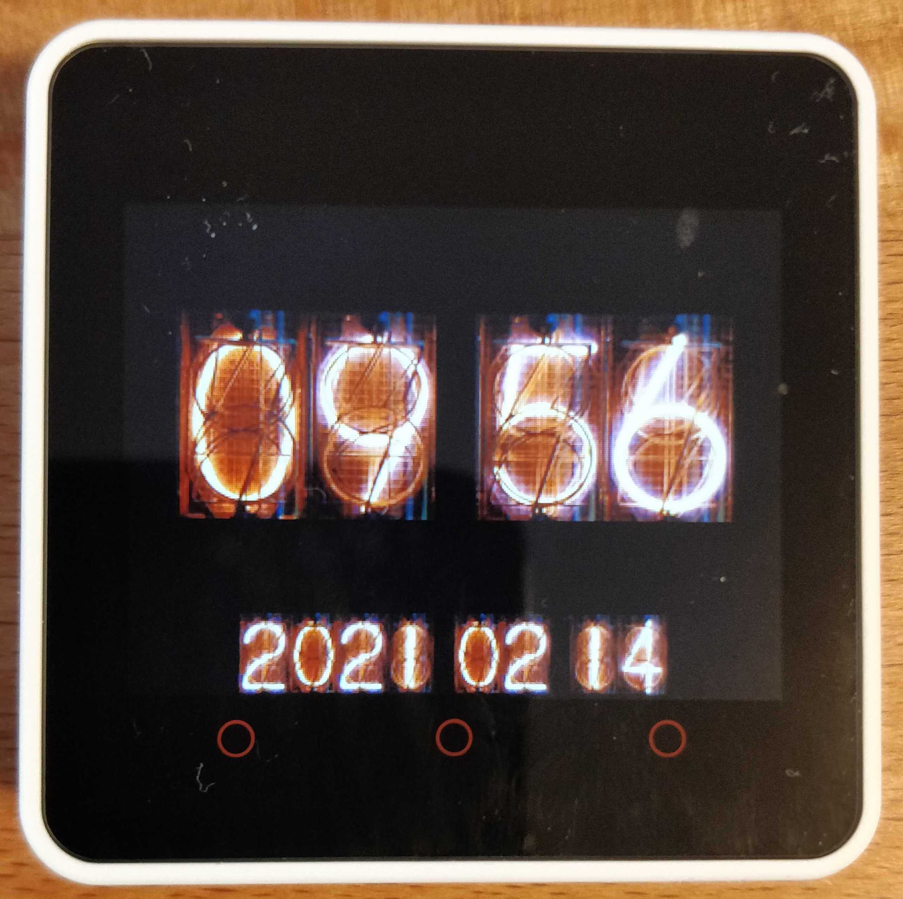

= Nixie Tube Clock

This project implements a clock showing date and time using Nixie tube images on
the
link:https://m5stack.com/products/m5stack-core2-esp32-iot-development-kit[M5Stack
Core2] device.

This software licensed under the link:LICENSE.md[MIT license].
